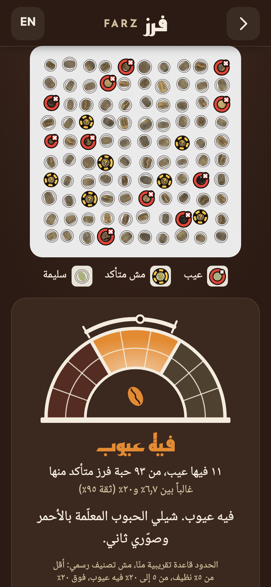
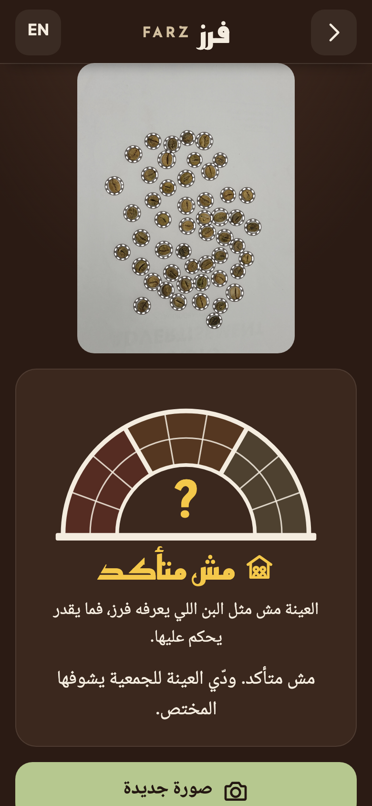
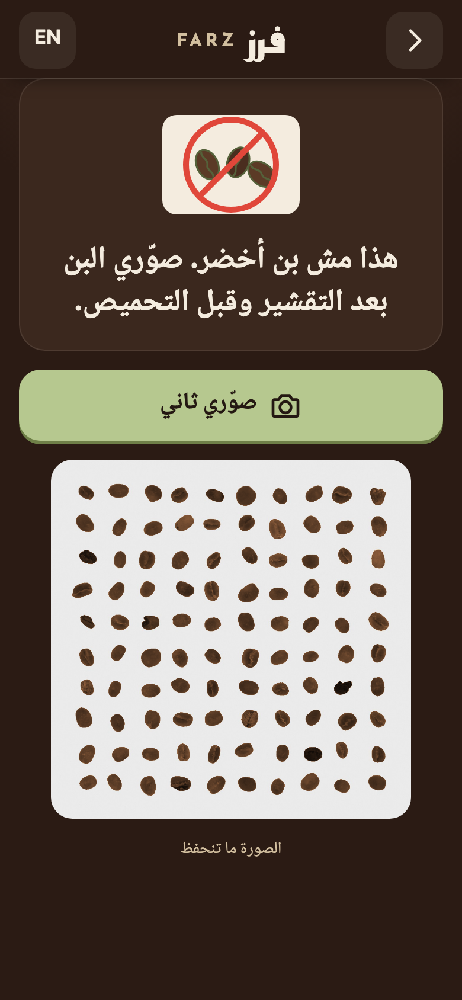
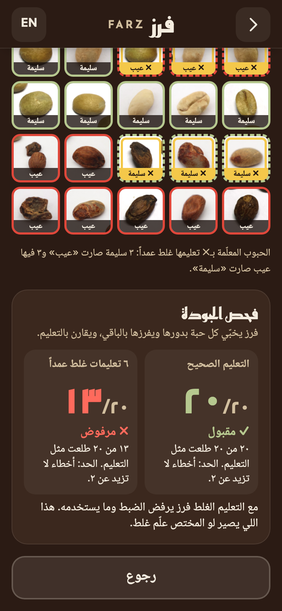

# Farz (فرز): count the bad beans before the price is set

**An offline phone check for coffee farmers in Yemen. One photo of about 100 hulled beans: the beans that look defective are circled in red, and when the evidence is thin it says «مش متأكد. ودّي العينة للجمعية» ("not sure, take the sample to the cooperative").**

**[▶ Try it live]({{LIVE_DEMO_URL}})** (runs offline after the first visit) &nbsp;·&nbsp; **[▶ World Bank video (3½ min)]({{WORLD_BANK_VIDEO_URL}})**

**What the farmer gets today:**
- a bean count and a dated slip she texts to her own basic phone;
- red circles on the beans to re-sort, when the evidence is clear;
- otherwise «مش متأكد» ("not sure, take it to the cooperative"). Never a price, never a grade.

<table>
<tr>
<td align="center" width="25%"><br><sub><b>A count, defective beans circled</b><br>SYNTHETIC demo tray (~12% defects)</sub></td>
<td align="center" width="25%"><br><sub><b>"Not sure": a person decides</b><br>real photo from India (CBD, grade AAA)</sub></td>
<td align="center" width="25%"><br><sub><b>"This isn't green coffee"</b><br>refused before the AI runs (SYNTHETIC roast-recoloured tray)</sub></td>
<td align="center" width="25%"><br><sub><b>Wrong labels are refused</b><br>PILOT calibration check (dataset labels stand in for a grader): 20/20 accepted, 6 wrong → 13/20 refused</sub></td>
</tr>
</table>

Hack-Nation 7th Global AI Hackathon · **Challenge 4: Small AI for Development** (World Bank) · **Agriculture** · **Yemen** (western highlands) · **Yemeni Arabic** (on screen; voice pending)

**Why you can trust it** (each number links to its source):
1. **Fails safe where our first model didn't.** On the auditor's 1,200 held-out J4ckDev trays (each recipe re-trained without those beans), our first model called [10 clean trays "many"](reports_v2/clean_model.json); the shipped one called none, answering [11 times, all correct](reports_v2/threshold_sweep.md), and "not sure" otherwise.
2. **Refuses rather than guesses on real photos:** [0 of 464](app/reports/browser_measure.json) real photos from India got a confident band (459 "not sure", 5 blur retakes).
3. **Counting needs no AI:** plain image processing counts within 2 beans on [406 of 464](reports/count_cbd.json) real photos.
4. **Small and offline:** a [3.1 MB model](reports_v2/clean_model.json) runs in the browser, offline after the first visit; [14 of 14 end-to-end tests](app/reports/e2e-results.json) pass (desktop Chromium; phone test pending).

> **Safe because it refuses unfamiliar samples; to answer on a new farm it needs locally labelled beans.**
> Per bean it scores [0.644 balanced accuracy](reports_v2/clean_model.json) on datasets it never saw (a coin flip is 0.5), so "not sure" is the usual answer. It can still be wrong: a strange sample that looks mostly sound would still get a band, and on one unseen dataset (samruddh) [about 1 band in 4 was one band off](reports_v2/threshold_seeds.json), never clean ↔ many. A cooperative grader can tune it on 20 labelled beans ([pilot](#the-cooperatives-calibration-a-labelled-pilot): passed on 1 of the 4 datasets tried).

[Problem](#problem-statement) · [How it works](#how-it-works-in-60-seconds-rules--ai--rules) · [AI or not](#what-is-ai-what-is-deliberately-not-ai-and-why-a-simpler-tool-would-not-do-the-job) · [Results](#results) · [New farms](#generalisation-what-a-new-farm-would-see) · [Calibration pilot](#the-cooperatives-calibration-a-labelled-pilot) · [Data](#data) · [Responsible AI](#responsible-ai-passfail) · [Limitations](#limitations) · [Run it](#run-it) · [Licences](#licences-and-attribution)

---

## Problem statement

> Because of this tool, **Noor, a coffee farmer in Yemen's western highlands and a member of her coffee cooperative,** will **get a dated count of the defective beans in a 100-bean sample of her own hulled lot, and know what to re-sort,** by **the time the price is set on that lot this harvest (October–December 2026)**, that she would otherwise **do worse: going into the sale with no count of her own and taking whatever price she is offered**; we know because Yemeni coffee is "mostly sold at the farm gates and can pass through several hands", margins rest on "the understanding between farmers and market players, not exactly on market rates", 51 per cent of respondents in one study of coffee farmers in Ibb "had a low knowledge of technical standards", and one exporter pays farmers "12 times higher than the usual market rate ($6 instead of 50 cents/kg) to ensure they follow strict picking and sorting protocols".

Sources: UNDP Yemen, *Value chain analysis of qat and coffee in Yemen*, 14 April 2022 (printed page, then PDF page):
- p. 24 (PDF p. 38): farm gates;
- p. 35 (PDF p. 49): margins; and the exporter (Port Mokha), which UNDP reports **from Bloomberg**;
- p. 20 (PDF p. 34): the 51% figure, from one study (Abdullah et al. 2016, Udeen area of Ibb), not a national survey;
- harvest months: p. v (PDF p. 6).

URL: https://www.undp.org/sites/g/files/zskgke326/files/2022-07/VC%20Analysis_Qat%20Coffee_FINAL%20with%20Disclaimer.pdf. Every quote is checked word for word in `docs/EVIDENCE.md`. Noor is the World Bank brief's persona; the brief makes her "a member of the Ondera Coffee Cooperative for eleven years" (brief p. 5). We place her in Yemen.

**Why this matters to Noor:**
- "Women mostly do the drying and sorting" (UNDP 2022, p. 20 / PDF p. 34).
- In Yemen, "the drying takes between 12 and 21 days, followed by selection, hulling, roasting" (p. 23 / PDF p. 37). Sorting happens on dried coffee, before hulling, so Farz checks a sample once the lot is hulled.
- Coffee is grown by over 104,000 farming families (a 2009 World Bank/SMEPS figure cited by UNDP 2022, p. 14 / PDF p. 28); FAO's 2025 factsheet says about 120,000 smallholders.
- Arabica's "first commercial cultivation ... is believed to have occurred there in the 1400s" (UNDP 2022, p. 14 / PDF p. 28).
- The Ministry's coffee extension is "offered only for payment" (p. 30 / PDF p. 44).
- Sources disagree on the farmer's share of value: 40–45% (UNDP 2022, one key informant) vs about 15% (Aden Chamber of Commerce, 2025). That gap is itself a sign that prices are not transparent.

---

## How it works, in 60 seconds: rules · AI · rules

```
 A SMARTPHONE: the daughter's at the weekend, or one at the cooperative       NOOR'S OWN BASIC PHONE
 +--------------------------------------------------------------------+     +---------------------------+
 | 1 Photo of ~100 hulled beans on a plain light sheet                 |     | SMS slip, typed by Farz,  |
 | 2 Quality gate: dark, count, blur, colour, touching      [RULES]    | --> | sent by Noor herself:     |
 | 3 Bean finder: one box per bean                          [RULES]    | sms:| date + bean and defect    |
 | 4 Per-bean classifier, MobileNetV3-Small ONNX, 3.1 MB    [AI]       | link| totals only +             |
 |   -> sound / defect / "?" (type shown only as "possibly")           |     | "self-check, not a grade" |
 | 5 Wilson 95% interval -> band ("about" if borderline),   [RULES]    |     +---------------------------+
 |   OR "not sure" (model unsure / implausible sample / dark lot)      |
 | 6 Red circles, one dot per bean, a fixed message         [FIXED]    |
 | 7 Last 5 records on the phone, one-tap wipe, no photos kept         |
 +--------------------------------------------------------------------+
```

1. **Photo.** About 100 beans from Noor's hulled lot, spread on a plain light sheet. The photo is decoded in the browser and never uploaded or stored. The bean finder works on a copy at most 1,200 px on its longest side.
2. **Quality gate (rules).** If the photo is too dark, has too few beans, is blurred, is not green coffee, has beans touching, or has a count outside 20–160, a fixed message asks for a retake and the AI is not run (`app/src/lib/rules.ts gate()`). One exception: a lot of single, bean-shaped beans with the colour of black green coffee gets "not sure, take it to the cooperative" instead of "not green coffee" (`app/src/lib/darklot.ts`, added 4 Oct; its colour limits rest on one real photo and synthetic roast, `reports_v2/threshold_ship.md` §5).
3. **Bean finder (rules, no AI).** Finds and crops the beans: within ±2 of the true count on 87.5% of 464 test photos.
4. **Per-bean classifier (the AI).** A MobileNetV3-Small runs on the phone in a Web Worker with onnxruntime-web.
   - **Sound** if P(good) ≥ 0.55 (0.50 until about 04:55 on 4 Oct; see [the threshold change](#the-sound-threshold-moved-from-050-to-055)).
   - **Defect** if P(defect) ≥ 0.91.
   - **"?"** otherwise, and always for touching beans.
   - The most likely defect type is shown on screen only under "Possible defect type — not certain". It is never spoken and never sent. History keeps the per-type counts of a banded result on the phone, but shows only the defect total.
5. **Sample rule (rules).**
   - If more than 60% of the answered beans look defective (an implausible sample), or the model is unsure of more than 15% of the beans: "not sure, take it to the cooperative".
   - Otherwise a band from the defect rate: under 5% / 5–20% / over 20%. These are our own rule of thumb, not an official grade. The band is shown with its 95% Wilson interval.
   - When the interval crosses a band edge, the band is marked "about" and Farz asks for another handful of the same coffee (up to 3 photos pooled).
6. **What she sees.** Red circles on the defective beans, a "bean ledger" with one dot per bean (100 beans found = 93 Farz was sure about + 7 not sure; 93 = 11 defect + 82 sound, on the ~12% demo tray), and a verdict that names its denominator: «١١ فيها عيب، من ٩٣ حبة فرز متأكد منها» ("11 with a defect, out of the 93 beans Farz was sure about"). The instruction comes from a fixed list, e.g. «فيه عيوب. شيلي الحبوب المعلّمة بالأحمر وصوّري ثاني» ("Some defects. Remove the beans marked red and photograph again."). The full list is `docs/CLIPS.md`.
7. **Voice.** The default build has **no audio**: every message is on screen, and Home says "Voice coming soon". The messages are written to be recorded by a Yemeni-Arabic speaker; recordings dropped into `app/public/audio/` under the listed file names switch the voice on with no code change (`app/public/audio/README.md`).
8. **Slip.** Optional. The exact text is shown on screen, then the phone's own Messages app opens with a short text for Noor to send to her own basic phone. It holds the date, the bean count, the defect total and the unsure count, or for a "not sure" result only the date, the bean count and «مش متأكد». Farz has no SMS service and no server.
9. **Optional: the cooperative's calibration pilot** ([below](#the-cooperatives-calibration-a-labelled-pilot)). It is inactive until a grader saves one.

---

## What is AI, what is deliberately not AI, and why a simpler tool would not do the job

| Step | AI? | Why |
|---|---|---|
| Quality gate, bean finder, counting | **No**: classic image processing (Otsu threshold, morphology, connected components) | Separated beans on a plain sheet can be counted without learning (measured: within ±2 beans on 87.5% of 464 photos). Rules are deterministic, testable and identical in Python and JavaScript |
| **"Is this bean sound or defective?"** | **Yes**: a computer-vision classifier | Insect holes, breaks and parchment are shape and texture cues, not one colour. Whether a simple colour rule could match the shipped model on unseen photos was **not measured** for this model, so we do not claim the CNN beats it |
| Local calibration (pilot) | **Yes**: nearest-prototype head on the model's embedding | Lets a grader adapt the per-bean call to the cooperative's own beans with 20 labels, on the phone |
| "How sure is the count? Is the sample plausible?" | **No**: a Wilson interval and fixed limits | An interval accounts for how many beans were checked; a model's confidence does not |
| What Farz says | **No**: a fixed list of pre-written messages | Nothing generated, so nothing hallucinated (brief glossary: "If it can say anything, it cannot be checked for safety") |

**Why not SMS, a spreadsheet or a search?** None of them can look at a bean. A spreadsheet can store a count, but someone still has to look at each of about 100 beans and decide what is wrong with it. This is the pattern the brief itself cites from Wadhwani AI's cotton tool, which photographs a pest trap and counts and identifies what is on it (brief, Annex B). Price apps exist without AI (brief, Annex B); Farz never gives a price.

---

## Results

All app numbers below come from the build of 4 Oct 2026, 05:18–05:25 BST (`reports_v2/threshold_ship.md`), measured in desktop Chromium, not on a phone.

### Bean finder (no AI): measured

| Test | Result | Source |
|---|---|---|
| CBD count test: **464** light-box photos, stated 50 beans each (India, CC BY 4.0) | exactly 50 on **280 (60.3%)** · within ±1 on **373 (80.4%)** · within ±2 on **406 (87.5%)** · mean absolute error **1.006 beans** · worst photo off by 15 (grade "Bits", broken pieces); errors lean towards over-counting | `reports/count_cbd.json` |
| J4ckDev, 11 photos | matches the dataset README on **10 of 11** (see the data note below) | `src/beans/make_crops.py` |
| Python vs the app's JavaScript port | counts identical on **21/21** photos; max box deviation 1 px with different JPEG decoders | `app/reports/beanfinder_parity_report.json` |
| Speed | all 464 photos in about 5–7 s on a MacBook M5 Pro (multi-process) | reviewer re-runs |

Reproduce: `.venv/bin/python src/beans/eval_count_cbd.py` → `reports/count_cbd.json`.

### Per-bean classifier (AI): the shipped model

| | Value | Source |
|---|---|---|
| File | `app/public/models/farz_beans.onnx`, **3,082,642 bytes (3.1 MB), fp16**, sha256 `c40c10f9…`; built as `models_v2/farz_beans_v2_clean_fp16.onnx` (`models_v2/` is not in the public repo) | `reports_v2/clean_model.json → model` |
| Training data | **7 public datasets that state a licence, 92,690 bean crops** (table in [Data](#data)). The 5 datasets that state no licence were used **only as test data** and are in no training pool | `reports_v2/clean_eval.json → final_weights_train_info`; `reports_v2/clean_model.md` §1 |
| Outputs | `probs` [N,6] (good, dark, insect, broken, unhulled, other defect; temperature T = 2.046 baked in) and `embed` [N,1024], the L2-normalised penultimate feature used by the calibration pilot | `reports_v2/clean_model.md` §5 |
| Per-bean rule | sound if P(good) ≥ **0.55**; defect if P(defect) ≥ 0.91; otherwise "?". At the earlier 0.50, the held-out predictions of all 6 dataset groups were answered on 69.5% of beans at 90.2% accuracy, in-sample for that threshold choice; this was not re-measured at 0.55 | `reports_v2/threshold_sweep.md`; `reports_v2/clean_model.json → pair_thresholds` |
| fp16 vs fp32 | 99.64% same top class, 99.53% same call (at 0.50 / 0.91), embedding cosine ≥ 0.99988, on all 23,447 CBD crops | `reports_v2/clean_model.json → fp16_vs_fp32` |
| Browser runtime vs Python | in the app's tests: max probability difference 4.6 × 10⁻⁴, 40/40 same calls, embedding cosine ≥ 0.999996 (40 crops); in the model run: max difference 4.9 × 10⁻⁴, 300/300 same calls (300 CBD crops) | `app/reports/classifier_parity_report.json`; `reports_v2/clean_model.json → wasm_parity` |
| Speed | tap to result in the built app, Chromium on the MacBook (**not a phone**), Web Worker: median **344 ms** on the 464 CBD photos (p90 362, max 493), 349–395 ms on the 7 demo trays. On the page thread: 332 ms, and 1,310 ms with the CPU slowed 4× | `app/reports/browser_measure.json`; `app/reports/e2e-measurements.json → timing` |
| On a phone | not yet measured (iPhone test pending; results go in `docs/RESPONSIBLE_AI.md` §9) | — |

### Generalisation: what a new farm would see

These are the numbers that matter for Noor, because none of the training data is Yemeni.

| Test | What it tells you | Result | Source |
|---|---|---|---|
| **Leave one dataset out** (the two afiyah sets, same uploader, phone and backdrop, are held out together) | sound vs defect on a dataset the model never saw | balanced accuracy **0.644** on average over the 5 groups that contain sound beans (0.556–0.801; a coin flip is 0.5). 3 of 6 groups fall below 90% answered accuracy with thresholds fitted without them | `reports_v2/clean_model.json → loso_licensed`; `clean_model.md` §2 |
| **The 5 unlicensed datasets, test only** | the same, on data that never touched training | USK **0.539**, daffa **0.541**, Mindforge 0.625 (near a coin flip on the first two); on the two sets with no sound beans, defect recall 0.963 (mfu17) and 0.999 (Notplying) | `reports_v2/clean_model.json → unlicensed_test_only` |
| **Defect type, J4ckDev photo never seen** (10 defect photos, 387 beans; argmax, no "?") | can it name the defect? | **30.0%**. Always guessing the commonest type ("dark", 148 of 387) scores **38.2%**. The good-bean photo (Normales) is a confident wrong answer: 73.8% of its beans are answered, every one "defect" | `reports_v2/clean_model.json → j4ck_lopo_typed_accuracy_same_10_as_v1`; `clean_model.md` §4; `reports/beans_lopo.json` |
| **CBD, 464 real photos from India** (size grades, no per-bean labels; never used for training or fitting) | does it rank grades sensibly? | broken pieces ("Bits") above top grade (AAA): AUROC **1.00**; Spearman with grade order **+0.68**; but **AA vs AAA 0.44**: it cannot separate the top grades | `reports_v2/clean_model.json → cbd`; `clean_model.md` §6 |
| **The app on those 464 photos** | what a farmer would hear | **0 confident bands**: 421 "not sure (implausible)", 38 "not sure (too many unsure)", 5 blur retakes. AAA "many": **0 of 50**. A separate Node run of the same app code gives 420 / 39 / 5, also 0 bands and 0 AAA "many" | `app/reports/browser_measure.json`; `app/reports/rules_measure_node.json` |
| **Held-out trays, shipped thresholds** (each licensed dataset scored by a model trained without it; the 5 unlicensed sets by the shipped model; 50- and 100-bean trays, 0–100% defects; plus the auditor's 1,200 J4ckDev trays) | how often it answers, and whether it is wrong | **24,800 trays: 16 bands, 1 wrong, 0 dangerous.** The 16: 5 samruddh (1 wrong: a clean tray called "some") and 11 "many" trays of the J4ckDev 1,200, all right. Every other dataset: 0 bands. **That is one random draw of trays.** On 20 further draws of the same design (run afterwards, not pre-registered): 12–29 bands per draw, **0 dangerous in every draw**, and every wrong band is samruddh's: **26 of its 105 bands wrong (about 1 in 4)**, each one band off. J4ckDev 1,200: 312 bands, 0 wrong. Every other dataset: 0 bands | `reports_v2/threshold_sweep.md`; re-run through the app's own code in `app/reports/threshold_app_measure.json`; 20 draws: `reports_v2/threshold_seeds.json` |
| The same trays at the earlier t_good 0.50 | why the threshold moved | 293 bands, 13 wrong, 0 dangerous. samruddh: **13 of its 52 bands wrong (25%)**, 12 clean trays called "some" and 1 "some" tray called "many". An earlier tray set gave the same picture: 42 bands, 11 wrong, all samruddh (`reports_v2/clean_model.json → trays_heldout_totals`). Over the 20 further draws: samruddh 217 wrong of 993 bands (22%) | `reports_v2/threshold_sweep.md`; `reports_v2/threshold_seeds.json` |
| The auditor's 1,200 J4ckDev trays (beans the fold models never saw) | the one set-up where it used to answer often | shipped: **11 bands, 0 wrong, 0 dangerous** (241 / 0 / 0 at t_good 0.50). First model (v1): 793 / 57 / **10** dangerous | `reports_v2/threshold_sweep.md`; `reports_v2/clean_model.json → j4ck_1200` |
| 777 software re-shoots of AAA/AA photos (exposure, colour cast, low resolution, blur, heavy JPEG) | robustness of the refusal | **0 bands** at t_good 0.50 with both perturbation sets; raising t_good cannot turn a "not sure" into a band (below), so this holds at 0.55 | `reports_v2/clean_model.json → stress_777_*` |
| Real held-out photos, each scored by a model trained without its dataset | does it answer on new real trays? | **0 bands**: lojano 0/36, loja_yolo 0/315, J4ckDev 0/11 (retake gates ignored, thresholds fitted without that dataset) | `reports_v2/clean_model.json → lojano_real, loja_yolo_real, j4ck_lopo_real` |

**What this means.** The fixed photo rules, not the model's accuracy, keep Farz safe. If more than 15% of the beans are unsure or more than 60% look defective, the answer is "not sure". On every new dataset we tried, that rule fired on almost every sample, so Farz rarely answers on a new farm. Those rules cannot catch an unfamiliar sample whose beans are confidently called mostly *sound*. Making the AI useful on Yemeni beans needs locally labelled beans: the [calibration pilot](#the-cooperatives-calibration-a-labelled-pilot) is a first step, and it is not validated on Yemeni beans.

### The sound threshold moved from 0.50 to 0.55

Two reviewers pointed out that the shipped t_good = 0.50 sat at the floor of the threshold grid, so a bean with P(good) just over 0.5 counted as sound with no margin, and that held-out samruddh trays got wrong bands at that setting.
- **The rule was fixed first.** The selection rule was written down and hashed at 04:53 BST on 4 Oct, 10 s before the sweep ran (SHA-256 `d8d95c87…`, re-checked after the results were added): take the smallest t_good in {0.50, 0.55, …, 0.75} with 0 dangerous trays everywhere and at most 5% wrong bands in every dataset that gets 10 or more bands. Nothing else was refit.
- **Result: 0.55** (`reports_v2/threshold_sweep.md`). At 0.50 the method reproduces the model run's 241 / 0 / 0 on the auditor's 1,200 J4ckDev trays.
- **Read it with care.** The sweep ran on the same held-out tray sets that showed the samruddh problem, so the 1 wrong band at 0.55 is in-sample for the choice of 0.55.
- **One draw understates the error on samruddh.** The rule saw one random draw of trays. On 20 further draws of the same design (run afterwards, not pre-registered; `reports_v2/threshold_seeds.json`), the same rule picks 0.55 in 18 and 0.60 in 2, and no draw has a dangerous tray at any candidate. On samruddh, 0.55 mainly makes Farz answer less often (105 bands over the 20 draws, against 993 at 0.50); when it does answer, **about 1 band in 4 is one band off** (26 of 105; 22% at 0.50), never clean ↔ many. On the J4ckDev 1,200 trays: 312 bands, 0 wrong.
- **What it costs.** The app now almost never gives a band on held-out data: on the 1,200 J4ckDev trays bands fall from 241 to 11, and only "many" trays still get one.
- **What does not change.** Raising t_good only moves beans from "sound" to "?". It cannot turn a "not sure" into a band, so every 0-band result measured at 0.50 still holds.
- **In the app:** `rules.ts V2_THRESHOLDS`, `public/models/farz_beans_labels.json`, the demo-tray manifest and all screenshots were updated and re-measured (`reports_v2/threshold_ship.md`). The calibration pilot's base call stays at P(good) ≥ 0.5, as its study pre-registered.

### What we tried before (kept for honesty)

| | v1 (3 Oct, retired) | v2, all 12 datasets (not shipped) | **v2, 7 licence-stated datasets (shipped)** |
|---|---|---|---|
| Training data | J4ckDev only: 582 crops from 11 photos, one photo per defect type | 118,143 crops, incl. 5 datasets with no licence | 92,690 crops, only datasets that state a licence |
| Within-photo held-out accuracy | **86.0%**: an **upper bound**, since train and test beans share each photo (`reports/beans_model.json`) | not measured | not measured |
| Defect type on a J4ckDev photo never seen (same 387 beans; commonest-type baseline **38.2%**, 148/387) | **27.4%**: below the baseline (`reports/beans_lopo.json`) | 42.9% (`reports_v2/AUDIT_V2.md` (2)) | **30.0%**: below the baseline (`reports_v2/clean_model.json`) |
| Sound vs defect, leave one dataset out, datasets with sound beans | – | 0.72 over 9 datasets; 0.66 once the two afiyah twin sets are held out together (`AUDIT_V2.md` (2), (6)) | **0.644** over 5 groups, twins held out together |
| CBD: Bits ranked above AAA (AUROC) | 0.07 (`AUDIT_V2.md` (6)) | 1.00 | 1.00 |
| CBD photos given a confident "many", 464 photos | 167 under the 3 Oct 22:42 rules (27 of 50 AAA). Then the 60% rule was added: 0 | 0 | **0** |
| Auditor's 1,200 J4ckDev trays: bands / wrong / **dangerous** | 793 / 57 / **10** | 229 / 0 / **0** | **11 / 0 / 0** at t_good 0.55 (241 / 0 / 0 at 0.50) |
| Why not shipped | confidently wrong on clean trays in its own set-up; one photo per class | trained on 5 datasets that state no licence | – |

An independent audit (`reports_v2/AUDIT_V2.md`, finished 02:10 BST on 4 Oct) tested the **all-12-datasets** v2 model and overturned two of our earlier claims:
- **Wrong headline: "0.78 balanced accuracy on new sources".** 3 of the 12 sources have no sound beans, so they score about 1.0 by calling everything defective. Over the sources with sound beans it was 0.72, and 0.66 once the afiyah twins are held out together.
- **Wrong comparison: "v2 is not more accurate than v1 in J4ckDev's set-up".** That compared v2 *with local re-calibration* against v1. The fair comparison is the 1,200-tray row above.

The auditor did not test the shipped model, which was built at 03:15. Our model run re-tested it with the auditor's protocols (`reports_v2/clean_model.md`), and an independent regression check later reproduced its leave-one-dataset-out score (0.6441) and the 1,200-tray result at t_good 0.50 (that check is not in the public repo). The audit's conclusion carries over: safe "because it refuses, not because it is accurate".

### Demo trays (synthetic, labelled as such)

Five **SYNTHETIC** trays (0, ~3%, ~12%, ~30% and ~40% defects) are J4ckDev bean crops pasted onto a grey sheet (`src/beans/make_demo.py`, `src/beans/make_demo_extra.py`). The shipped model was trained on J4ckDev, so these trays show the flow, not accuracy. Outcomes in the built app, Chromium (`app/reports/browser_measure.json → demo`; `app/public/demo/manifest.json`; asserted by e2e test 4):

| Tray | Outcome | Sound / defect / "?" | Defects / answered, 95% range |
|---|---|---|---|
| SYNTHETIC 0% | clean | 96 / 0 / 4 | 0/96, 0.0–3.8% |
| SYNTHETIC ~3% | about clean + another handful | 96 / 3 / 1 | 3/99, 1.0–8.5% |
| SYNTHETIC ~12% | some | 82 / 11 / 7 | 11/93, 6.7–20.0% |
| SYNTHETIC ~30% | about many + another handful | 67 / 25 / 8 | 25/92, 19.1–37.0% |
| SYNTHETIC ~40% | many | 57 / 37 / 6 | 37/94, 30.1–49.5% |
| Real CBD photo `cbd_aaa_2` (India, AAA) | not sure (implausible; at t_good 0.50 it was "too many unsure") | 5 / 9 / 36 | — |
| Real CBD photo `cbd_bits_262` (India, broken pieces) | not sure (implausible) | 4 / 27 / 19 | — |

Ranges are 95% Wilson intervals computed from the counts above. Three handfuls of the ~3% tray pool to 9 of 297 (e2e test 5).

### Data-integrity notes (measured)

- **JMuBEN, a public coffee-leaf dataset, is mostly copies.**
  - Its Cercospora folder has **7,681 files, but only 322 are byte-unique and only 82 are pixel-unique.**
  - Rust: 8,336 files → 1,042 byte-unique. Phoma: 6,571 → 691.
  - A random split on it leaks test images into training. We de-duplicate by hash first.
- **Two "different" bean datasets are one set-up.** afiyah_deteksi and afiyah_bijikopi come from the same uploader, the same phone model and the same backdrop. Held out one at a time, each kept its twin in training and looked far better than it is. We now always hold them out together (`reports_v2/AUDIT_V2.md` (1)).
- **J4ckDev "good" photo.** The README says 255 beans; our bean finder counts 195, and a visual check shows about 195 beans, all boxed. We use the 582 beans actually found.

---

## The cooperative's calibration: a labelled pilot

**The idea.** The brief describes Small AI as something that "can be trained or tuned on local data" (brief §02–03). No public dataset we found contains a single Yemeni bean, so the person who already grades the coffee should be able to tune Farz on the phone. In the app (Home → "Calibrate for your cooperative", marked PILOT), the grader photographs up to 3 trays and labels 10 sound and 10 defective beans. The phone builds a small head from the model's 1,024-number embedding of those 20 beans (two average vectors and a margin), runs a leave-one-out quality check, and saves it on the phone. Nothing is retrained, uploaded or sent, and no photo is kept (`app/src/lib/localcal.ts`; method in `reports_v2/localcal_spec.md`).

**The test, with its bar written down first** (02:14 BST on 4 Oct; SHA-256 `d97a6694…`, re-checked; `reports_v2/localcal.md`). Base model trained without the test dataset; 20 labelled beans; 5 random draws.

| Dataset | Answered accuracy, class-balanced (bar ≥ 90%) | Clean trays called "many" (bar 0) | Verdict |
|---|---|---|---|
| **loja_yolo** (Ecuador; the pre-registered primary) | **96.3%** (worst draw 95.5%); coverage 78.3% | **0** in 2,500 trays; 0 CBD AAA "many" | **GO** |
| lojano (Ecuador) | about 85% | **11** | fails |
| Mindforge (test-only) | about 79% | 3 (1 at K = 20, 2 at K = 50) | fails |
| USK (Indonesia, test-only) | 63–67% (base model alone 64%): not rescued | 0 | fails |

**So it passed on 1 of the 4 datasets it was tried on**, and the GO is narrow: on loja_yolo the base model alone already reached 97.4% answered accuracy (65.7% coverage), so calibration added coverage, not accuracy. 131 of 2,500 trays got a band (17 one band off, 0 dangerous). With lojano heads, one AA and one A photo from the Indian CBD set were called "many". No Yemeni beans, no phone, no re-photographed trays.

**How the app ships it:** off by default; refused if more than 2 of its 20 beans are mis-sorted in leave-one-out (our post-hoc rule, not validated: in the study it would still have let one bad lojano head through); "Calibrated for: <name>" on every result; a real pilot needs an acceptance test on the cooperative's own trays not used for calibration (the app asks for it but cannot enforce it).

**The in-app demo is the quality check only.** Labels from the public loja_yolo dataset stand in for a grader: correct labels pass 20/20 and are accepted; the same beans with 6 deliberately wrong labels give 13/20 and are refused (`app/reports/calib_demo_check.json`; e2e test 10). The demo never saves or installs a calibration, and a cooperative's saved calibration is byte-identical after running it. It replaced a before/after demo that showed no change on its own in-sample photos (`app/reports/localcal_demo_measure.json`). Full account: `docs/MODEL_CARD.md` §3.

---

## Where Farz sits in Noor's day

| When | What happens | Source |
|---|---|---|
| Harvest, October–December (picked 6–10 times) | Noor is on the slope all day; the phone is at the house | UNDP p. v; brief p. 5 |
| 12–21 days of drying, then selection | Women mostly do the drying and sorting | UNDP p. 23 (PDF p. 37); p. 20 (PDF p. 34) |
| Hulling | At the cooperative: some cooperatives have donor-provided processing machines, e.g. the Talok Women's Coffee Association (Taiz) and Bani Sinan (Sana'a). Or she hand-hulls a sample at home | UNDP p. 68 (PDF p. 82) |
| **Farz check, before the price is set** | About 100 beans from **her** hulled lot on a plain light sheet. One photo, on her daughter's smartphone at the weekend or a smartphone at the cooperative. Red circles and a short instruction say what to remove; she re-sorts and checks again. If Farz says "not sure", the sample goes to the cooperative's grader | our design |
| Price | She has a dated count of her own on her basic phone. **The cooperative grader is the human in the loop**: in our design a person checks the physical sample, and Farz's count is never the grade. The grader can also calibrate Farz for the cooperative (pilot). No grader process has been tested with real graders (roadmap) | our design |

### What Farz asks of Noor that she does not do today (the brief asks: "does it add other constraints?")

| New constraint | Mitigation |
|---|---|
| **A hulled sample.** Yemeni farmers sort before hulling (UNDP p. 23), the brief's Noor sells her parchment to a middleman (brief, Annex B), and Farz checks hulled beans | Use it at the cooperative when her lot is hulled, or hand-hull about 100 beans. How long hand-hulling a sample takes, and whether farmers will do it, is **not measured** |
| **A plain light sheet and enough light** (white cloth or A4 paper) | The quality gate asks for a retake on dark, blurred or cluttered photos |
| **A smartphone at least once a week** (her daughter's at the weekend, or one at the cooperative) | The result goes to her own basic phone as an SMS she sends herself |
| **A one-time download of about 21.7 MB** on a bought 3G bundle (measured: the default build's first-visit precache is 57 entries, 21,226.13 KiB in the 4 Oct 06:31 build) | Once only; then it runs offline. "Add to Home Screen" so the browser keeps it (whether iOS keeps the cache between weekends is untested) |
| **Reading the screen**, until the voice clips are recorded (only 41.0% of rural women aged 15–49 are literate, MICS 2022–23) | Pictures and red circles carry the result; the voice pack is the fix (not recorded yet) |
| **A browser that supports WebAssembly SIMD** (the runtime needs it; minimum iOS/Android versions not verified) | None yet: the app should show a clear message on older phones |

**Tech stack**

| Layer | Tools |
|---|---|
| Training | Python 3.11 · PyTorch 2.14.1 (Apple MPS) · torchvision 0.29.1 MobileNetV3-Small (ImageNet-pretrained, 6-class head) · source-balanced sampling, partial-label loss for untyped defects · temperature scaling · export to ONNX (opset 17), fp16 via onnxconverter-common · onnxruntime 1.30.0 for checks · scikit-learn for the calibration study's logistic alternative |
| App | React 19 + Vite 8, installable web app (PWA) with a service worker (vite-plugin-pwa / Workbox) · onnxruntime-web 1.30.0 (wasm, 1 thread, Web Worker) · right-to-left Arabic UI (Noto Naskh Arabic, Reem Kufi) · IndexedDB · `sms:` link |
| Tests | Python reference vs JavaScript port parity fixtures · vitest unit and parity tests (**126 passed, 5 opt-in measurements skipped**, 05:25 BST on 4 Oct) · Playwright e2e in Chromium **14/14** (05:25 BST on 4 Oct; `app/reports/e2e-results.json`) |
| Hosting | Static files only (no backend); any static host can serve `app/dist`. The live link is at the top of this page |

---

## Data

### Build data

**Training data of the shipped model: only datasets that state a licence** (`docs/DATA_SOURCES_V2.md`; crop counts from `reports_v2/clean_eval.json`):

| Dataset | Licence (as stated by the source) | Kept crops | URL |
|---|---|---|---|
| J4ckDev Green Coffee Beans (11 photos, one per class) | **CC BY-NC-SA 4.0** | 582 | https://github.com/J4ckDev/GreenCoffeeBeansDataset |
| vicanadya16 (16 SCA defect classes, tight crops, no sound beans) | CC0 (anonymous uploader, provenance unverified) | 86,123 | https://www.kaggle.com/datasets/vicanadya/coffee-defect-16-classes |
| loja_yolo (Loja, Ecuador; tray photos with per-bean labels) | CC BY 4.0 in the download's `README.dataset.txt` (Kaggle page: Apache 2.0) | 1,311 | https://www.kaggle.com/datasets/cristianyagg/defectos-grano-de-cafe-de-la-provincia-de-loja |
| lojano (Loja, Ecuador; good vs defective trays) | **CC BY-NC 4.0** | 1,182 | https://www.kaggle.com/datasets/patopucho/lojano-arabica-coffee |
| samruddh_grading (Coorg, India; grades A and D used) | MIT | 1,337 | https://huggingface.co/datasets/SamruddhK/coffee-bean-grading-dataset |
| afiyah_deteksi + afiyah_bijikopi (one uploader, one phone: held out together) | CC0 (no description) | 985 + 1,170 | https://www.kaggle.com/datasets/afiyahmusrah/deteksi-biji-kopi · https://www.kaggle.com/datasets/afiyahmusrah/bijikopideteksi |
| **Total** | | **92,690** | |

**Test-only data (never trained on, not redistributed):**
- **mfu17, usk_coffee (Kaggle mirror), daffa_defect, mindforge_doubleside, notplying_defects.** None states a licence, so by default all rights are reserved. They appear in no training pool of the shipped model: every fold's training log was checked (`reports_v2/clean_model.md` §1). They are used only to measure how the model does on data it never saw.
- **CBD Coffee Bean Dataset**, 464 photos × 50 beans, Wayanad, India, **CC BY 4.0** (https://data.mendeley.com/datasets/52877z55vr/1). Used for:
  - the count test and the photo-rule safety test;
  - two unmodified demo photos (`app/public/demo/cbd_aaa_2.jpg` = AAA/2.jpg, `cbd_bits_262.jpg` = Bits/262.jpg).

**In the app:**

| Asset | What it is | Licence | Size |
|---|---|---|---|
| **SYNTHETIC: 5 demo trays** (`app/public/demo/tray_synthetic_00/03/12/30/40.jpg`) | demo button only; shows the flow, not accuracy | CC BY-NC-SA 4.0 (made from J4ckDev crops) | 145,283 / 147,248 / 148,115 / 149,938 / 151,966 bytes |
| Calibration demo (`app/public/calib-demo/`) | 20 labelled loja_yolo crops used by the quality-check demo, plus 3 loja_yolo photos resized from 6000×4000 to 2400×1600; **in-sample** for the shipped model | CC BY 4.0, credit in `calib-demo/CREDITS.md` | 3 photos: 356,563 / 336,104 / 332,959 bytes |
| Voice clips (`app/public/audio/`) | **none in the default build**: the folder holds only a README listing the 19 file names from `docs/CLIPS.md`. Recordings in Yemeni Arabic, dropped in under those names, switch the voice on. Text-to-speech placeholders exist for local testing only and are not in the public repo | — | 0 audio files |

**Leaf "country pack" (smoke test, not in the Yemen app).** BRACOL (Brazil), JMuBEN (Kenya) and Uganda, de-duplicated to 3,935 images. All three are CC BY 4.0; downloads of 164.5 / 245.8 / 26.0 MB. See `docs/DATA_CARD.md`.

Why no dataset from the brief's Annex B: none of them has photos of individual green beans with defect labels; the brief says the listed datasets "are just suggestions".

### Problem evidence

| Figure | Country | Year | Source | Page (printed / PDF) |
|---|---|---|---|---|
| Coffee "mostly sold at the farm gates" | Yemen | 2022 | UNDP value chain analysis | p. 24 / 38 |
| "Women mostly do the drying and sorting" | Yemen | 2022 | UNDP | p. 20 / 34 |
| Drying 12–21 days, "followed by selection, hulling, roasting" | Yemen | 2022 | UNDP | p. 23 / 37 |
| 51% of respondents in one study (Udeen, Ibb) had low knowledge of technical standards | Yemen | 2016 study, cited 2022 | UNDP citing Abdullah et al. | p. 20 / 34 |
| One exporter (Port Mokha) pays 12× the usual rate ($6 vs $0.50/kg) to farmers who follow its strict picking and sorting protocols | Yemen | 2022 | UNDP citing Bloomberg | p. 35 / 49 |
| Cooperatives "equipped by donors with processing machines", incl. Talok Women's Coffee Association (Taiz) | Yemen | 2022 | UNDP | p. 68 / 82 |
| UNDP recommends supporting "the creation of coffee cooperative organizations" | Yemen | 2022 | UNDP | p. 46 / 60 |
| Losses up to 20–35% from "fallen and broken beans, pests, and diseases"; the major pest is the Coffee Berry Moth | Yemen | 2022 | UNDP | p. 39 / 53 |
| Coffee rust "still not a major issue in Yemen" | Yemen | 2022 | UNDP | p. 43 / 57 |
| Over 104,000 coffee-farming families | Yemen | 2009 study, cited 2022 | UNDP citing World Bank/SMEPS | p. 14 / 28 |
| First commercial cultivation of Arabica "believed to have occurred there in the 1400s" | Yemen | 2022 | UNDP | p. 14 / 28 |
| About 120,000 smallholders, about 35,000 ha | Yemen | 2025 | FAO OCOP factsheet CD5957EN | — |
| 24,640 t green coffee, 669 kg/ha | Yemen | 2023 | FAOSTAT | — |
| Farmer keeps about 15% of final value (vs 40–45% in UNDP) | Yemen | 2025 | Aden Chamber of Commerce | — |
| 3.2% of farming households got any extension | Yemen | 2011 data | GFRAS (Qamar 2012) | — |
| World Bank FSRRP planned an "electronic agricultural extension services platform"; extension indicators 0.00 on 27 Nov 2025 | Yemen | 2021 / 2026 | FSRRP appraisal doc; ISR Feb 2026 | Component 4c |
| Literacy, women 15–49: 41.0% rural, 29.3% Raymah | Yemen | 2022–23 | MICS | Table SR.6.1W |
| Households with a phone: 85.6% rural, 72% Raymah | Yemen | 2022–23 | MICS Statistical Snapshot | p. 10 |
| Internet users 17.49% | Yemen | 2019 | World Bank WDI (API re-checked 3 Oct 2026) | — |
| At least 3G coverage 75%; 4G 57% | Yemen | 2023 | ITU Arab States report, Jan 2025 | p. ~17 |
| Account ownership: women 5.4%, men 18.3% | Yemen | 2022 | Global Findex (API re-checked) | — |
| No coffee in WFP's Yemen price data; about 530 vs 1,555 YER/USD in different zones | Yemen | 2024 / 2026 | WFP via HDX | — |
| All 12 speech-recognition models tested get 54–82% of Yemeni-dialect words wrong (9–26% on Yemeni-accented MSA) | Yemen | 2026 | Bulbul, arXiv 2608.21950 | Tables 4–5 |

Full quotes, URLs and how each was checked: **`docs/EVIDENCE.md`**. None of the problem evidence is synthetic.

### What our data does not cover

- **No Yemeni beans.**
  - None of Udaini, Dawairi, Tufahi or Bura'ai, and no natural-process beans.
  - Darker Yemeni naturals may be flagged defective and **under-grade the farmer's coffee**.
- **Per-bean calls do not transfer.** Sound vs defect on a dataset never seen: 0.644 balanced accuracy on average, 0.54 on two unlicensed test sets. Defect type on a photo never seen: 30.0%, below the commonest-type baseline (38.2%).
- **Sound beans are scarce and come from few set-ups.** In the shipped training data, sound beans come from 6 datasets (2,643 crops). vicanadya16, by far the biggest set, has none.
- **Studio-like photos only.**
  - Light boxes, plain sheets and single-bean close-ups. No rooftop sun, cheap Android cameras or sack backgrounds.
  - PlantVillage-trained models fell from 99.35% to 31.4% on real photos.
- **No unhulled coffee and no whole lots.** Farz checks a hulled sample. Whether farmers will hull one is not measured.
- **The "insect" class may be the wrong pest.** UNVERIFIED reading: J4ckDev's and Loja's "broca" beans are probably damage by the coffee berry borer, which EPPO does not list for Yemen. UNDP names the Coffee Berry Moth as Yemen's major pest (p. 39). Farz never names a pest, and types are never stated as facts.
- **No moisture, density or taste defects.** Farz never says "specialty" or "grade".
- **No Yemeni grader labels, and we found no public Yemeni coffee price series** (WFP's Yemen price data has no coffee). The AI never quotes a price.
- **Not every village has a cooperative.** UNDP recommends supporting "the creation of coffee cooperative organizations" (p. 46 / PDF p. 60). Farz's "not sure" sends Noor to a cooperative; where there is none, a pilot needs another named decision-maker (a processing unit or association). Not designed yet.
- **No Yemeni data on women's phone ownership.** Findex 2025 excludes Yemen, and we could not check GSMA's country list.
- **No voice yet.** The default build is silent; once recorded, one voice and one dialect.
- **The count test uses Indian light-box beans**, not Yemeni beans on cloth.
- **Black and roasted beans have little real test data.** The dark-lot rule's colour limits come from one real photo (J4ckDev Negros) and synthetic roast; real roasted coffee is untested.

What we do about each gap: `docs/DATA_CARD.md` §5.

---

## Responsible AI (pass/fail)

| Requirement | Farz |
|---|---|
| **Fail-safe: "not sure, ask a person"** | Rules, not the model, decide when to refuse. Dark, too few beans, blurred, not green coffee, touching, wrong count → retake. Model unsure of more than 15% of beans, more than 60% of answered beans defective (implausible), or a lot of black beans → «مش متأكد. ودّي العينة للجمعية يشوفها المختص» ("Not sure. Take the sample to the cooperative for a specialist to check."). A borderline count is marked "about" and she is asked to photograph another handful (e2e test 5). Measured: 0 confident bands on 464 real Indian photos, 777 re-shoots and the real held-out trays above; 0 dangerous bands in 24,800 held-out trays (16 bands), nor in 20 further draws of them |
| **Fixed answer list** | A fixed list of pre-written messages (`docs/CLIPS.md`); nothing generated. Never a price, a pesticide, a pest species or "borer". Defect types are never spoken or sent; on screen they appear only as "possibly …" under "not certain" |
| **Human in the loop** | Noor decides, and she presses send herself. The slip says «فحص ذاتي مش تصنيف» ("self-check, not a grade"). In our design the cooperative grader checks the physical sample before the price is set, and may calibrate Farz (pilot, off by default) |
| **Consent** | Nothing is sent unless she taps send in her own Messages app. The exact text is on screen first. **Known gap:** with no voice in the default build, a woman who cannot read cannot check the slip, and only 41.0% of rural women aged 15–49 are literate (MICS 2022–23) |
| **Privacy: where data sits** | The photo is processed on the phone and never uploaded or stored. Only the last 5 records are kept, on the phone: date, total and band, plus, for a banded result, the per-type counts (History shows only the defect total). A calibration stores two average vectors, a margin, a cooperative name and counts, never photos. No account, no personal name, no location, no server, no analytics |
| **Lost or shared phone** | At most 5 dated records are visible; one tap wipes them. There is no account to break into |
| **Bias** | Trained on non-Yemeni beans; on new datasets it often calls sound beans defective (e.g. USK: 14.7% of sound beans confidently called defective), so it may under-grade Yemeni coffee. Mitigations: counts not grades, no types as facts, colour gate, per-bean "?", the 15% and 60% rules, a person decides |
| **Licences** | The shipped model is trained only on datasets that state a licence; two are non-commercial (one ShareAlike), so the model is a **non-commercial, ShareAlike research prototype**. The 5 unlicensed datasets were used for testing only and are not redistributed |

**Limits Farz respects** (the brief asks "are the limits respected?"): the four §06 rules (runs on a device the user has, core feature offline, small model, a local-language interaction: written Yemeni Arabic now, spoken once recorded), plus: never a price, a pesticide or a pest species; no diagnosis of why yields dropped; no grade.

Status in desktop Chromium (`app/e2e/offline.spec.ts`, 14/14, 4 Oct 05:25 BST), each covered by an e2e test: the offline demo-tray result and slip; timing; a dark-photo retake, an empty-sheet retake, history and one-tap wipe; all 7 demo trays; pooling of up to 3 handfuls; "not sure" slip privacy; a worker that never starts; synthetic touching trays; the calibration quality-check demo and the grader flow; the bean ledger; the dark-lot rule; the no-voice default build. The rules are covered by unit tests (vitest 126 passed, 5 opt-in skipped). Phone tests: pending (`docs/RESPONSIBLE_AI.md` §9). Full account: **`docs/RESPONSIBLE_AI.md`**.

---

## Scalability, replication and what happens next

- **Another coffee origin** needs two things:
  - a **voice pack**: the message list recorded by a local speaker;
  - **local labelled beans**: at least a grader's calibration, checked on trays not used to calibrate. Generalisation above shows this is the real bottleneck.

  The bean finder, the rules and the app do not change.
- **A less-supported language** (the brief asks). Farz uses **no speech recognition and no translation**, so a language with no AI support at all still works. Mehri (about 260,000 speakers) is absent from MMS, Common Voice and FLORES-200, but a Mehri Farz needs a speaker to record the message list, not a model.
- **A starting point for a second crop problem: coffee leaves (smoke-tested only).**
  - `src/prep.py` and `src/train.py` train a 5-class leaf classifier (healthy, rust, miner, phoma, cercospora) on Brazil + Kenya, with **Uganda held out as an unseen country**.
  - In Yemen, UNDP says rust is "not a major issue", which is why the Yemen build checks beans instead.
  - The pipeline runs end to end (smoke test: 6.1 MB fp32 → 1.88 MB INT8 ONNX, about 1 ms per image on CPU); its accuracy is not meaningful after 2 epochs and is not reported.
- **An institutional home.** The World Bank's Yemen FSRRP project planned an "electronic agricultural extension services platform and call-in advisory service", and its extension indicators were still 0.00 in November 2025. Farz could serve as an offline module for that service.
- **Running cost.** Static files: no server to run, no per-message fees (Noor's own SMS plan sends the slip), no API keys. Passing the files phone to phone is possible in principle but untested.
- **Next steps.**
  1. Record the message list in Yemeni Arabic and run a comprehension test.
  2. Pilot with one cooperative. The grader calibrates on 20 beans, then checks Farz on trays not used for calibration. Only if it passes does the calibration stay on. With each farmer's consent, the grader's labels could become the first open, labelled set of Yemeni bean photos.
  3. Retrain and re-measure on Yemeni beans, holding out whole cooperatives.
  4. iPhone and Android tests on real phones, with real touching beans, mixed-size lots, hands and roasted beans.
  5. A named fallback decision-maker where there is no cooperative.

## Limitations

- **Per bean, the AI does not transfer to new farms.** Sound vs defect averages 0.644 balanced accuracy on held-out datasets (coin flip 0.5); defect type on a photo never seen is 30.0%, below always guessing the commonest type (38.2%). The safety comes from the photo rules, and they make "not sure" the usual answer on new data: with the shipped thresholds, 16 bands in 24,800 held-out trays (12–29 in each of 20 further draws).
- **The rules miss one case.** An unfamiliar sample that the model confidently calls mostly *sound* still gets a band.
- **The 0.55 threshold was chosen on the trays that exposed the problem.** Its 1 wrong band in 24,800 trays is in-sample for that choice, and one draw: on 20 further draws, about 1 samruddh band in 4 is one band off (26 of 105), none dangerous.
- **The calibration pilot passed on one dataset only** (loja_yolo). The same method called clean trays "many" on two other datasets. It is not tested on Yemeni beans, on a phone, or on re-photographed trays, and the in-app quality-check demo uses dataset labels the shipped model was trained on.
- **Borderline counts.** At 100 beans the band is firm only for 0, 10–12 or 28–60 defects; other counts are marked "about" and she is asked for another handful.
- **Devices.** Tested in desktop Chromium only (Playwright, Pixel 7 emulation). iPhone: test pending. Android: untested.
- **Voice.** None in the default build until recordings are added; no comprehension test has been run.
- **Black and roasted beans.** A lot of black beans gets "not sure" (one real photo, J4ckDev Negros). Dark and medium roast get "not green coffee", and light-roast trays now get no band, but all roast tests are synthetic recolours (`reports_v2/threshold_ship.md` §5).
- **Frame edge.** The bean finder's frame-edge check never fires, so a bean cut off by the photo edge is still counted and classified. Keep beans away from the edges.
- **Touching beans** (measured on synthetic trays only, in internal regression checks that are not in the public repo; re-measured with the shipped model at t_good 0.50). The touching rule catches pairs, clumps and chains whenever at least 5 single beans lie apart. Known limits:
  - **(R1)** a tray where every bean sits in a tight side-by-side pair: with v1 some all-sound trays got "about many"; with the shipped model those trays end in a spread retake or "not sure";
  - **(R2)** a broken piece pressed against a whole bean merges into one blob, so the result can look cleaner than it is (7 of 9 such synthetic trays "about clean" where the truth was 10%);
  - **(R3)** lots with widely mixed bean sizes can get a false "spread the beans out" retake.

  Spread the beans out.
- **Not built.** The cooperative grader step is a process design, not tested with real graders.
- **Assumptions.** A hulled sample on a plain light sheet.
- **Licence.** The model is a non-commercial, ShareAlike research prototype (see below).

---

## Run it

```bash
# Python (3.11 venv). Raw datasets are not in the repo; download links are in docs/DATA_CARD.md and docs/DATA_SOURCES_V2.md
.venv/bin/python src/beans/eval_count_cbd.py     # bean-finder count test -> reports/count_cbd.json
.venv/bin/python src/beans_v2/data_build_crops.py --sources <names> --workers 8   # v2 crops (then --merge)
# v2 licence-stated model. FARZ_SCRATCH = a folder outside the repo for the crop cache and fold weights. In src/beans_v2:
python train_folds.py licensed    # the shipped weights (7 licence-stated datasets, seed 0)
python clean_folds.py worker      # leave-one-dataset-out fold models (3 parallel workers, about 60 min of MPS)
python clean_eval.py              # held-out evaluation, temperature, thresholds -> reports_v2/clean_eval.json
python clean_export.py            # fp32 + fp16 ONNX with probs + embed      -> models_v2/ (not in the public repo), reports_v2/clean_export.json
python clean_simulate.py          # photo and tray safety simulations        -> reports_v2/clean_deploy.json
python threshold_sweep.py         # pre-registered t_good sweep               -> reports_v2/threshold_sweep.json
python localcal.py                # pre-registered calibration study         -> reports_v2/localcal.json
python localcal_export.py         # calibration demo set                     -> models_v2/localcal_demo/ (not in the public repo)
python clean_report.py            # headline figures                         -> reports_v2/clean_model.json
node localcal_spec_check.mjs      # calibration spec in onnxruntime-web

# App
cd app && npm ci && npm test && npm run build    # static PWA in app/dist (no voice by default)
npm run test:e2e                                 # 14 Chromium e2e tests (builds and serves on port 4180)
```

Notes:
- The v1 scripts (`src/beans/train_beans.py`, `eval_lopo.py`, `eval_ood_cbd.py`) reproduce the history table.
- `reports/beans_heldout_preds.npz` and `reports/beans_ood_cbd_preds.npz` are included in this repo, so the v1 tables can be re-computed without retraining.
- The fold weights (`*.pt`) and `models_v2/` are not included. The shipped model is `app/public/models/farz_beans.onnx`.

## Licences and attribution

Different parts of this repository carry different licences. The full list, with attribution, is in **`NOTICE.md`**. The code licence is in **`LICENSE`**, and the model licence is in **`MODEL_LICENSE.md`**.

| Component | Licence | Note |
|---|---|---|
| Our code | MIT, see `LICENSE` | — |
| **Classifier weights** (`app/public/models/farz_beans.onnx`) | **CC BY-NC-SA 4.0**, see `MODEL_LICENSE.md` | Trained on J4ckDev (CC BY-NC-SA 4.0) and lojano (CC BY-NC 4.0) among others, so a **non-commercial, ShareAlike research prototype** |
| J4ckDev Green Coffee Beans | CC BY-NC-SA 4.0 | From the thesis *"Estimación de la Calidad del Café a Partir de la Caracterización de los Defectos en el Grano Verde Utilizando Técnicas de Procesamiento de Imágenes"*, https://github.com/J4ckDev/GreenCoffeeBeansDataset |
| lojano | CC BY-NC 4.0 | training only; not redistributed |
| loja_yolo | CC BY 4.0 | training; calibration demo crops and photos (resized) in `app/public/calib-demo/` (credit in `CREDITS.md` there) |
| samruddh_grading | MIT | training only; not redistributed |
| vicanadya16, afiyah_deteksi, afiyah_bijikopi | CC0 | training only; provenance of these anonymous uploads unverified |
| mfu17, usk_coffee mirror, daffa_defect, mindforge_doubleside, notplying_defects | no licence stated | **test only**; not in the shipped weights; not redistributed |
| SYNTHETIC demo trays | CC BY-NC-SA 4.0 | Composites of J4ckDev crops, labelled "synthetic" in the app |
| CBD Coffee Bean Dataset | CC BY 4.0 | https://data.mendeley.com/datasets/52877z55vr/1 · demo images `cbd_aaa_2.jpg` and `cbd_bits_262.jpg` are unmodified copies of AAA/2.jpg and Bits/262.jpg |
| BRACOL, JMuBEN, Uganda coffee-leaf sets | CC BY 4.0 | leaf pack only |
| ImageNet-pretrained MobileNetV3-Small weights (torchvision) | UNVERIFIED | torchvision code is BSD |
| onnxruntime-web, onnxruntime | MIT | — |
| React, Vite, vite-plugin-pwa, workbox-window, Tailwind CSS | MIT | — |
| Noto Naskh Arabic, Reem Kufi fonts | SIL OFL 1.1 | — |
| PyTorch | BSD-style (multi-licence) | — |
| torchvision | BSD | — |
| ONNX, onnxconverter-common | Apache-2.0 / MIT | — |
| NumPy | BSD-3-Clause | — |
| scikit-learn | BSD-3-Clause | — |
| Pillow | MIT-CMU | — |
| Voice clips | none in this repository | The default build has no audio; see `app/public/audio/README.md` |
| ElevenLabs | not used in this build | If a final clip is generated with it at build time, a native speaker checks each clip. The app never calls ElevenLabs |

## Clean-room statement

Farz was built during the hackathon weekend (3–4 October 2026) in a personal repository by a solo team. It contains no code, data or material from the author's employer. All third-party data and software are listed above under their own licences.

## Repository map

```
README.md                  this file
LICENSE, MODEL_LICENSE.md, NOTICE.md   code licence, model licence, every dataset and its licence
docs/EVIDENCE.md           every figure: quote, source, page, year, URL, how it was checked
docs/DATA_CARD.md          build data, licences, sizes, what the data does not cover
docs/DATA_SOURCES_V2.md    the 12 bean datasets: licences, mapping, crops, de-duplication
docs/MODEL_CARD.md         bean finder (no AI), classifier (AI), calibration pilot, generalisation, failure modes
docs/RESPONSIBLE_AI.md     fail-safes with example outputs, privacy, consent, bias, tests
docs/CLIPS.md              the fixed message list (the complete answer list)
src/beans/                 bean finder (frozen reference), v1 training and evaluations, demo trays
src/beans_v2/              v2 data build, training folds, evaluation, export, threshold sweep, calibration study
src/prep.py, src/train.py  leaf pipeline (smoke test only)
app/                       the offline web app (app/README_APP.md: build, tests, bundle, deploy)
app/screens/               screenshots used above (Arabic and English)
reports/                   v1 results (JSON, PNG, NPZ)
reports_v2/                v2 results, the independent audit (AUDIT_V2.md), the threshold sweep (+ 20-draw check), the calibration study
```
